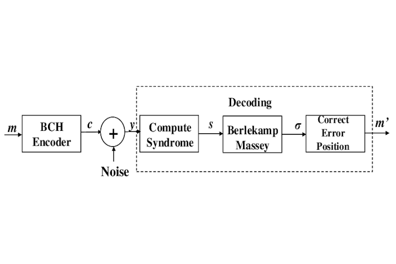

# BCHDecoderVHDL

## 🚀 Overview  


**BCHDecoderVHDL** is an open-source project aimed at designing a **BCH error-correcting decoder in VHDL**, built for **FPGA implementation using an Avalon interface**. This hardware module is integrated into a **SoC system based on an Intel Cyclone V** and deployed on a **DE0-CV development board running at 25 MHz**.

## 🎯 Purpose  
- 🧮 **Error Correction**: Implements BCH decoding for binary data error detection and correction.  
- 🔗 **Avalon Interface Compatibility**: Designed to connect seamlessly to Avalon-compliant systems.  
- 🧩 **Quartus Integration**: Ready for integration into Intel Quartus projects targeting DE0-CV boards.  
- 🧠 **CPU Exploitation**: Enables communication with a Nios II or other Avalon master for data exchange.  

## 📝 Features  
| 🏷️ Feature | 🔍 Description |
|-----------|----------------|
| 🧮 **BCH Decoder** | Implements syndrome calculation, Berlekamp-Massey algorithm, Chien Search |
| 🔗 **Avalon Interface** | Supports Avalon-MM or Avalon-ST as needed |
| ⚙️ **VHDL Design** | Modular, synthesizable VHDL code |
| 🧠 **CPU-Controlled** | Controlled by an Avalon master processor |
| 🧪 **VHDL Testbench** | Comes with a simulation testbench for functional validation |
| 🧱 **DE0-CV Ready** | Optimized for 25 MHz operation on DE0-CV |
| 🖥️ **Quartus Project** | Integrated via Qsys / Platform Designer |
| 📦 **Open-source** | Fully modifiable and extensible HDL source code |

## 📐 Design Architecture Preview
| ⚙️ Internal Architecture | 🖥️ Qsys Integration |
|--------------------------|----------------------|
|  |  |

## 🗂️ Project Structure
```bash
BCHDecoderVHDL/
├── ip/                  
│   └── BCH/                
│       ├── bch.vhd         # VHDL source files
│       └── simulation/     # VHDL testbenches
├── DE0_CV.qpf              # Quartus project file
├── software/               # Scripts or files related to software development
```

## 📦 Use Cases
- ✅ Embedded communication systems
- ✅ FPGA-based secure data transmission
- ✅ Educational demonstration of error-correcting codes

## 🌟 License  
This project is open-source. Feel free to use, modify, and contribute! 🚀
